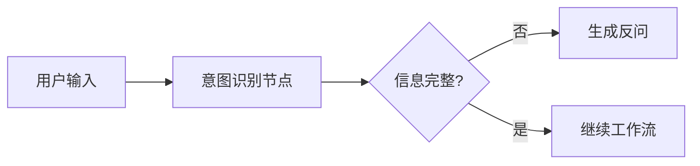
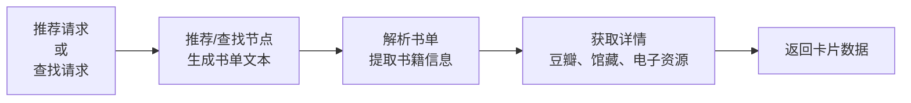
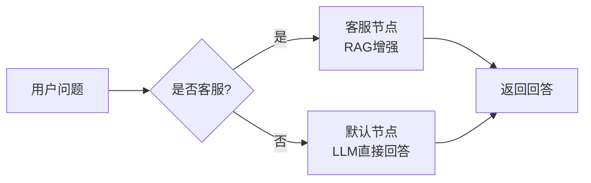

# LangGraph 工作流节点 (Workflow Nodes)

## 概述

Book Agent 使用 LangGraph 定义的有向图工作流，包含 8 个不同功能的节点，协同完成用户查询的处理。每个节点负责特定的职责，通过状态机方式将数据从一个节点传递到下一个节点。

## 节点清单

| 节点名称 | 功能 | 输入 | 输出 |
|---------|------|------|------|
| [意图识别](intent-recognition.md) | 分析用户查询，识别意图类型 | 用户查询文本 | query_type, slots |
| [查找书籍](find-book.md) | 生成查找特定书籍的结果文本 | book_titles | book_list_text |
| [书籍信息](book-info.md) | 获取书籍详细信息 | query_type, book_title | content |
| [推荐书籍](recommendation.md) | 生成人类可读的推荐书单 | slots | book_list_text |
| [解析书单](parse-book-list.md) | 从文本提取结构化书籍数据 | book_list_text | recommended_books |
| [获取详情](fetch-details.md) | 并行获取多源详细信息 | recommended_books | book_cards |
| [客服处理](customer-service.md) | RAG 增强的客服咨询 | user_query | final_response |
| [默认处理](default.md) | 通用查询回答 | user_query | final_response |

## 工作流架构

### 高层流程

```
用户输入
    |
    v
[意图识别] 确定用户意图
    |
    +-- find_book -----------> [查找书籍] -> [解析书单] -> [获取详情] -> 返回
    |
    +-- book_recommendation -> [推荐书籍] -> [解析书单] -> [获取详情] -> 返回
    |
    +-- book_info -----------> [书籍信息] -> 返回
    |
    +-- customer_service ----> [客服处理] -> 返回
    |
    +-- default ------------> [默认处理] -> 返回
    |
    v
返回结果给用户
```

## 详细说明

### 1. 意图识别流程



**主要职责**:
- 使用 LLM 识别用户意图
- 从用户输入提取相关槽位信息
- 当信息不足时，生成反问引导用户

**输入**: 用户查询文本
**输出**: query_type（意图类型）和 slots（提取的信息）

### 2. 图书推荐和查找流程



**流程特点**:
- 推荐节点：LLM 生成自然语言推荐理由和书单
- 查找节点：LLM 生成查找结果的文本表述
- 两者都生成文本，都由解析节点提取结构化数据
- 解析节点用 LLM 从文本中提取结构化信息
- 获取详情节点并行调用 3 个数据源（豆瓣、馆藏、电子资源）
- 整个流程支持流式输出

### 3. 客服和通用查询



**特点**:
- 客服节点支持 RAG 知识库检索
- 默认节点支持网络搜索和思考展示
- 两者都支持流式输出

## 状态定义

所有节点共享统一的状态机：

```python
class BookRecommendationState:
    # 用户和会话信息
    user_query: str                    # 用户查询
    session: Session                   # 会话对象

    # 意图识别阶段
    query_type: str                    # 意图类型
    slots: Dict                        # 提取的槽位信息

    # 推荐流程
    recommended_books: List[Dict]      # 推荐的书籍列表
    book_list_text: str                # 推荐文本
    book_cards: List[Dict]             # 构建好的卡片数据
    books_without_resources: List      # 无资源的书籍

    # 通用字段
    dialogue_response: str             # 对话中间响应
    final_response: str                # 最终返回给用户的响应
    streaming_tokens: List[str]        # 流式输出的令牌

    # 搜索结果（用于查找节点）
    search_results: List[Dict]         # 搜索结果
    search_success: bool               # 搜索是否成功

    # 错误处理
    error: Optional[str]               # 错误信息
```

## 节点间数据流

### 推荐/查找流程数据传递示例

```python
# 1. 意图识别节点输出
# 推荐路径
state = {
  "query_type": "book_recommendation",
  "slots": RecommendBookSlots(topic="编程")
}

# 或查找路径
state = {
  "query_type": "find_book",
  "slots": FindBookSlots(book_titles=["Python高效编程"])
}

# 2. 推荐/查找节点生成文本
state.update({
  "book_list_text": "推荐思路：...\n推荐书单：《Python高效编程》...",
  # 或对于查找节点
  # "book_list_text": "正在查找以下书籍：《Python高效编程》..."
})

# 3. 解析书单节点提取结构化数据
state.update({
  "recommended_books": [
    {"title": "Python高效编程", "author": "张三", "reason": "..."}
  ]
})

# 4. 获取详情节点丰富数据
state.update({
  "book_cards": [
    {
      "title": "Python高效编程",
      "author": "张三",
      "reason": "...",
      "rating": "8.5",
      "image": "https://...",
      "hasLibrary": true,
      "libraryItems": [{"name": "市中心图书馆", ...}],
      "hasResources": true,
      "resources": [{"source": "微信读书", "books": [...]}]
    }
  ]
})
```

**两条路径的共同点**：
- 都先生成文本
- 都由同一个解析书单节点处理
- 都由同一个获取详情节点构建卡片
- 都支持流式输出

## 流式输出支持

推荐、默认、客服节点都支持流式输出：

```python
state["streaming_tokens"] = []

async for token in session.astream(...):
    state["streaming_tokens"].append(token)
```

前端通过 SSE 事件监听实时接收文本：

```javascript
eventSource.addEventListener('stream', (event) => {
  const token = JSON.parse(event.data);
  displayText(token);  // 实时显示
});
```

## 错误处理策略

| 场景 | 处理方式 |
|------|---------|
| 意图识别失败 | 降级到 default 节点 |
| 查找不到书籍 | 返回空结果列表 |
| 推荐生成失败 | 返回错误信息 |
| 内容审核失败 | 返回审核失败提示 |
| RAG 服务不可用 | 客服节点自动降级到纯 LLM |
| API 调用超时 | 返回已生成的部分内容 |

## 性能考虑

### 并行处理

获取详情节点使用 `asyncio.gather()` 并行调用 3 个数据源：

```python
tasks = [
  fetch_douban_info(),
  fetch_library_info(),
  fetch_digital_resources()
]
results = await asyncio.gather(*tasks)
```

### 条件优化

- **豆瓣查询**: 书籍数 ≤ 5 时才获取（否则可能超时）
- **快速模型**: 解析等任务使用 qwen-flash 而非 qwen3-max
- **流式输出**: 减少前端等待时间

## 配置和扩展

### 添加新节点

1. 创建新的节点函数：
```python
async def my_new_node(state: BookRecommendationState) -> BookRecommendationState:
    # 处理逻辑
    return state
```

2. 在工作流中注册：
```python
workflow.add_node("my_node", my_new_node)
```

3. 添加边（路由）：
```python
workflow.add_edge("previous_node", "my_node")
```

### 修改节点行为

每个节点都遵循一致的接口：
- **输入**: BookRecommendationState
- **输出**: 修改后的 BookRecommendationState
- **异步**: 所有节点都是 async 函数

## 监控和调试

### 日志级别

每个节点在执行时输出日志：

```python
logger.info("📍 节点: intent_recognition")
logger.info(f"📚 识别到的意图: {query_type}")
logger.info(f"✓ 节点执行完成")
```

### 调试技巧

1. 检查状态内容: `print(state)`
2. 添加 breakpoint: `import pdb; pdb.set_trace()`
3. 启用 DEBUG 日志: `LOG_LEVEL=DEBUG`

## 相关文件

- 工作流定义: [graph_workflow.py](../../../backend/graph_workflow.py)
- 节点源码: [nodes/](../../../backend/nodes/)
- 系统提示词: [prompts/system_prompts.py](../../../backend/prompts/system_prompts.py)
- 会话管理: [session/](../../../backend/session/)

## 相关文档

- [意图识别节点详解](intent-recognition.md)
- [查找书籍节点详解](find-book.md)
- [书籍信息节点详解](book-info.md)
- [推荐节点详解](recommendation.md)
- [解析书单节点详解](parse-book-list.md)
- [获取详情节点详解](fetch-details.md)
- [客服节点详解](customer-service.md)
- [默认节点详解](default.md)

---

最后更新: 2026-03-16
